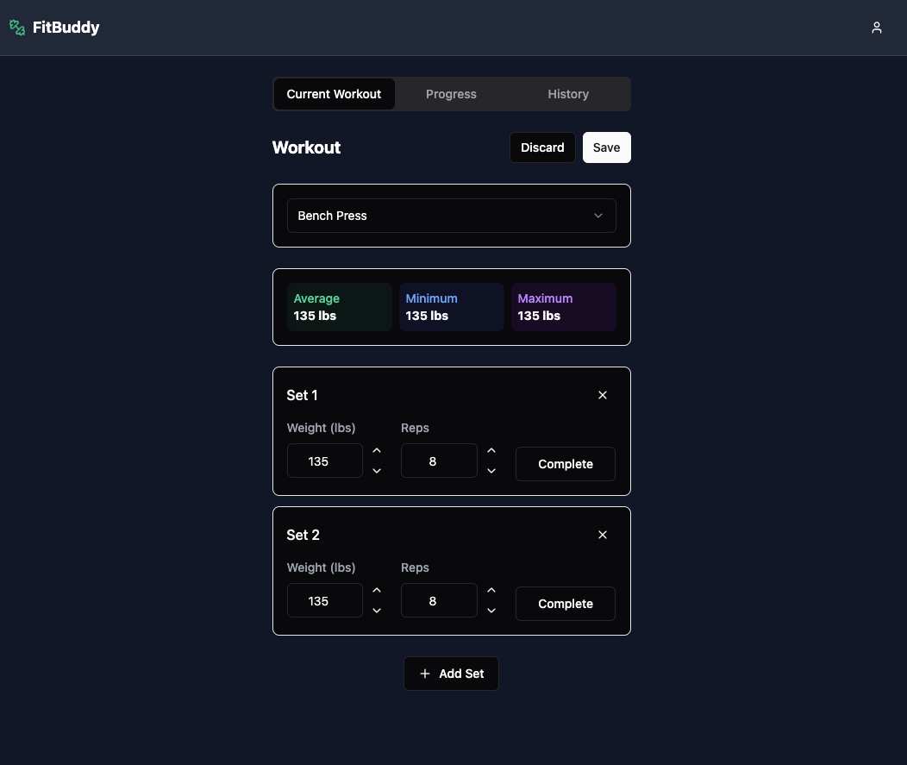
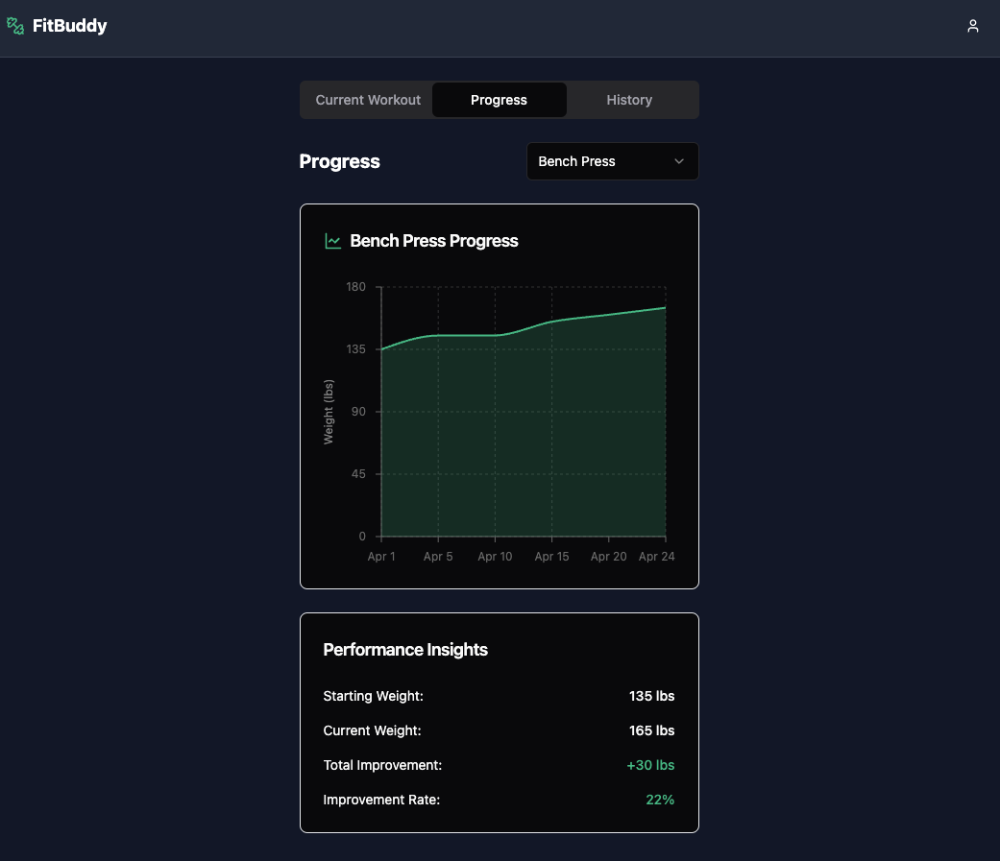

# FitBuddy - Workout Tracking App

<div align="center">
  
  <h3>Track your workouts. Achieve your goals.</h3>
</div>

## 📱 Screenshots

<div align="center">
  <div style="display: flex; flex-wrap: wrap; gap: 10px; justify-content: center;">
    <!--  -->
    
    
  </div>
</div>

## ✨ Features

- **User Authentication** - Sign up, sign in, and guest mode
- **Workout Tracking** - Log sets, reps, and weights for each exercise
- **Progress Visualization** - Track your improvement with interactive charts
- **Exercise Library** - Choose from common exercises or add your own
- **Dark/Light Mode** - Choose your preferred theme
- **Responsive Design** - Works on mobile, tablet, and desktop
- **Offline Support** - Track workouts even without internet connection

## 🚀 Getting Started

### Prerequisites

- Node.js 18.0.0 or later
- npm or yarn

### Installation

1. Clone the repository:
   ```bash
   git clone https://github.com/yourusername/fitbuddy.git
   cd fitbuddy
